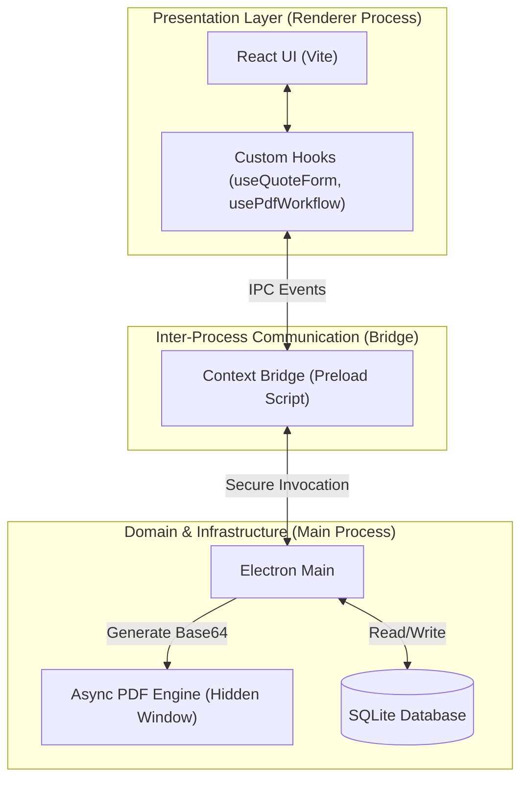

# Sistema de Cotizaciones SIMAR - Desktop App 🚛♻️

## 📖 Executive Summary

**Calculadora SIMAR** is an enterprise-grade desktop application designed to automate, standardize, and secure the quoting and logistics calculation process for the waste management sector.


### 🔴 The Business Problem

Historically, the company generated quotes manually using spreadsheets. This process introduced critical operational and business risks:

- Each quote required **20–30 minutes** of manual data entry.
- High margin for human error in complex logistics and viaticum calculations.
- Lack of traceability and auditability.
- Risk of sales fraud due to post-generation modification of approved quotes.

### 🟢 The Solution

A standalone **Local-First Desktop Application** that enforces business rules natively and provides:

- ✅ Automated logistics, transportation, and supplies calculations.
- ✅ Strict quote immutability after approval.
- ✅ Asynchronous high-fidelity PDF generation.
- ✅ Persistent local audit trails.
- ✅ Complete offline availability.
- ✅ No external infrastructure dependencies for end users.

---

# 🏗️ System Architecture

The project follows a **Clean Architecture** approach adapted for Electron, ensuring strict separation of concerns between presentation, business logic, and infrastructure.

## Technology Stack

| Layer | Technology | Purpose |
|---------|------------|---------|
| Frontend UI | React 19 + TypeScript + Vite | Reactive user interfaces and state management |
| Styling & Components | Tailwind CSS + shadcn/ui | Responsive and accessible design system |
| Desktop Host | Electron | Native OS integration and filesystem access |
| Persistence Layer | SQLite (better-sqlite3) | Embedded relational database |
| Testing | Vitest + React Testing Library | Unit and integration testing |

---

## Architecture Diagram



---

# 📐 Architectural Decision Records (ADRs)

To demonstrate architectural maturity, the following design decisions and trade-offs were made during development.

---

## ADR-001: SQLite for Persistence

### Context

The application needs to store sensitive pricing catalogs and historical quotes without depending on internet connectivity or external infrastructure.

### Decision

Use embedded SQLite through `better-sqlite3`.

### Benefits

- Zero infrastructure cost.
- Zero network latency.
- Full relational database capabilities.
- Easy backup and portability through a single `.sqlite` file.

### Trade-off

Sacrifices immediate multi-user synchronization in favor of:

- Reliability
- Simplicity
- Offline availability

---

## ADR-002: Enforced Immutability (`draft → issued → replaced`)

### Context

The business required protection against unauthorized modifications to quotes already delivered to customers.

### Decision

Implement a strict state machine at the database level.

Once a quote reaches the `issued` state:

- It becomes read-only.
- Modifications are prohibited.
- Corrections require generating a new quote linked through `replaces_quote_id`.

### Benefits

- Historical integrity.
- Non-repudiation.
- Complete auditability.
- Fraud prevention.

---

## ADR-003: Decoupled PDF Generation Service

### Context

Generating heavily styled, multi-page PDFs blocks JavaScript execution and degrades UI responsiveness.

### Decision

Isolate PDF rendering into an asynchronous Electron service using hidden windows and IPC communication.

### Benefits

- Maintains UI responsiveness.
- Prevents interface freezing.
- Supports processing batches of 15+ PDFs concurrently.
- Better user experience under heavy workloads.

---

## ADR-004: Secure Credential Management

### Context

Distributed desktop binaries present security risks if secrets are exposed improperly.

### Decision

Reject insecure approaches that expose environment variables directly inside distributed binaries.

Authentication data and hashes are managed through secure implementations following industry-standard security practices.

### Benefits

- Reduces credential exposure.
- Prevents credential harvesting from decompiled executables.
- Improves overall application security posture.

---

# 🔐 Security & Auditing

## Local Authentication

Secure login mechanism controlling access to the application dashboard.

### Features

- User authentication.
- Session isolation.
- Protected access to critical operations.

---

## Audit Trail

Every critical business action is recorded.

Examples:

- Quote creation.
- State transitions.
- Quote replacement.
- PDF generation.

Stored metadata includes:

- Timestamp.
- Responsible user.
- Action performed.

---

## Input Validation

End-to-end validation strategy using:

- TypeScript type safety.
- Runtime validation with Zod.

Benefits:

- Early error detection.
- Improved reliability.
- Safer data processing.

---

# 🎨 User Experience (UX)

The interface follows Nielsen's usability heuristics to minimize training requirements and improve productivity.

## Design Principles

### Visibility of System Status

Provides immediate feedback during heavy operations.

Example:

- Loading large datasets such as 145,000+ SEPOMEX records without blocking the interface.

### Error Prevention

Includes read-only review screens before irreversible actions.

Example:

- SummaryStep preview before final PDF generation.

### Flexibility & Efficiency

Additional logistics modules integrate directly into the quoting workflow without requiring separate processes.

---

# ⚡ Key Quality Attributes

| Attribute | Implementation Strategy |
|------------|-------------------------|
| Maintainability | SOLID principles and SRP-driven architecture |
| Performance | Asynchronous processing for heavy I/O operations |
| Integrity | Relational constraints and immutable workflows |
| Usability | Offline-first responsive UI |
| Reliability | Local persistence with transactional consistency |
| Security | Authentication, validation, and auditing mechanisms |

---

# 👨‍💻 Engineering Role & Scope

## Role

**Software Engineer (End-to-End Implementation)**

## Duration

**4 Months**

## Responsibilities

### Requirements Engineering

- Stakeholder interviews.
- Requirements elicitation.
- Business rule validation.

### Architecture & Design

- Technical stack selection.
- Database design.
- UML modeling.
- Architectural decision-making.

### Full-Stack Development

- UI/UX implementation.
- Business logic development.
- Database implementation.
- Electron integration.

### Quality Assurance

- Unit testing.
- Integration testing.
- Bug fixing.
- Validation workflows.

### DevOps & Deployment

- Build pipeline configuration.
- Windows executable packaging.
- Release preparation.

---

# 🚀 Build & Run

## Prerequisites

### Node.js

```bash
>= 18.x
```

### Operating System

```text
Windows (required for final executable packaging)
```

---

## Development

```bash
npm install

npm run dev
```

---

## Production Build (Windows x64)

```bash
npm run build:win
```

### Output

Build artifacts are generated in:

```text
dist/
```

Including:

- Standalone installer.
- Windows executable package.

---

# 🌟 Key Features

- Enterprise Quote Management
- Logistics Cost Calculation
- Viaticum Calculation Engine
- Secure PDF Generation
- Offline-First Operation
- SQLite Persistence
- Electron Desktop Application
- Audit Trail System
- Immutable Quote Workflow
- Authentication Module
- Clean Architecture
- Type-Safe Development
- Automated Testing

---

# 📄 License

This project is distributed under the terms specified in the repository license.

## 🚀 Requisitos Previos

Antes de empezar, asegúrate de tener instalado:
* [Node.js](https://nodejs.org/) (Versión 20 o superior recomendada)
* Git

## 🛠️ Instalación y Configuración para el Equipo

**1. Clonar el repositorio**
**`git clone https://github.com/maverick0322/Calculadora-Cotizaciones-SIMAR.git`**
**`cd GestorResiduos-Desktop`**

**2. Instalar dependencias**
**`npm install`**

**3. Compilar módulos nativos**
Como usamos SQLite (una base de datos nativa en C++), cada vez que instales paquetes nuevos debes decirle a Electron que los recompile para su entorno interno. Ejecuta:
**`npx electron-builder install-app-deps`** y **`npm install lucide-react`**

**4. Levantar el entorno de desarrollo**
**`npm run dev`**

